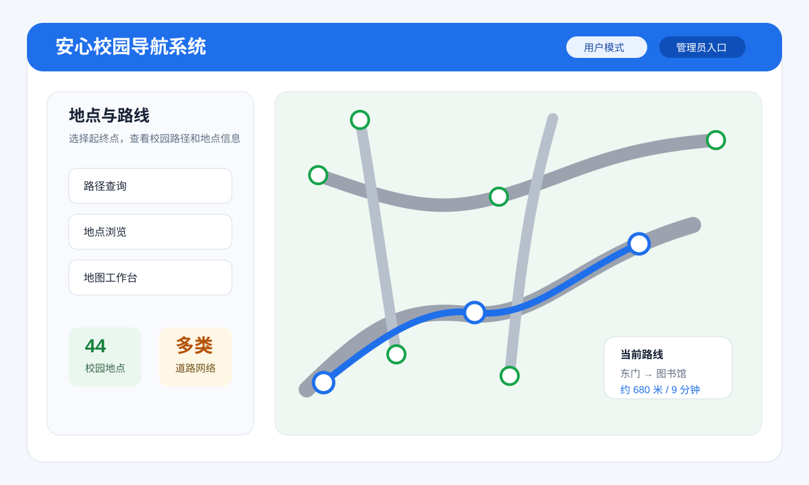
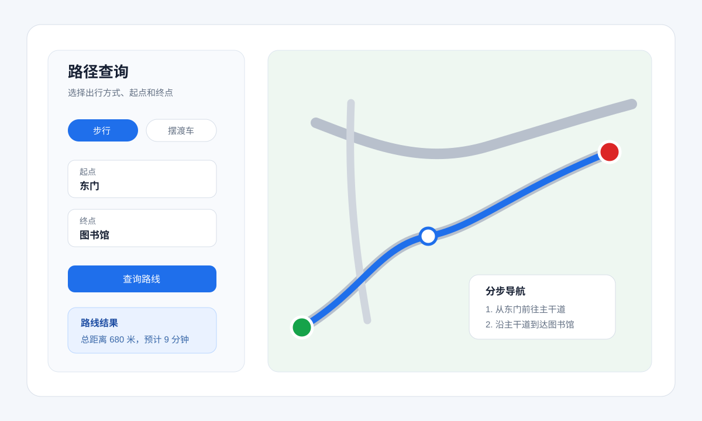
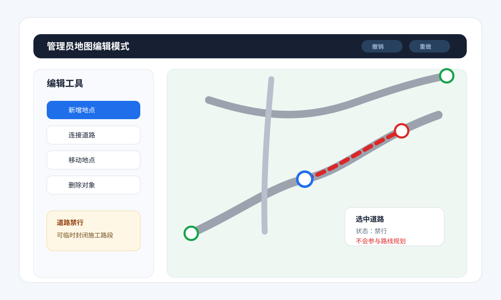
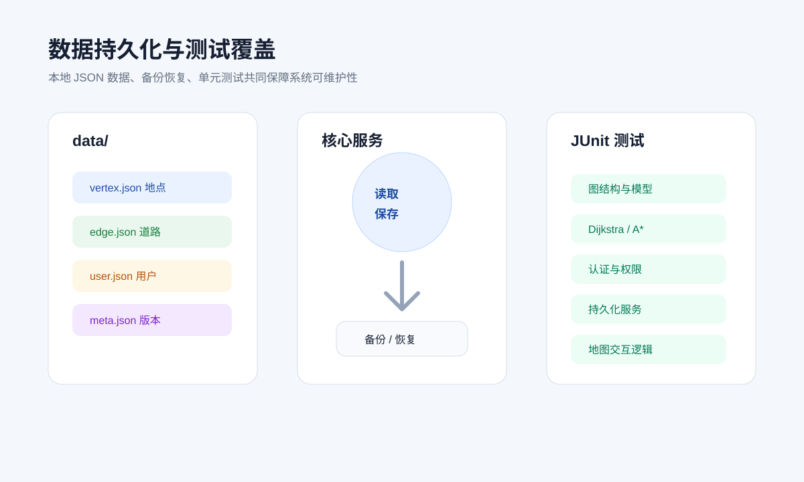

# 安心校园导航系统

安心校园导航系统是一款基于 Java Swing 的校园路线规划桌面应用。项目以校园地点和道路为图结构基础，支持地点浏览、起终点路线查询、路径高亮、分步导航、管理员地图维护、道路禁行设置、数据备份恢复等功能，适合作为 Java 课程设计、图论算法实践或桌面端管理工具示例项目。

## 项目截图

### 首页与地图总览



### 路径查询与路线展示



### 管理员地图编辑



### 数据持久化与测试覆盖



## 技术栈

| 类型 | 技术 | 说明 |
| --- | --- | --- |
| 编程语言 | Java 8 | 使用 JDK 8 语法与标准库实现核心逻辑 |
| 构建工具 | Maven | 统一管理编译、依赖与测试 |
| 桌面界面 | Java Swing | 构建主窗口、表单、导航栏、管理面板 |
| 图形绘制 | Java 2D / Graphics2D | 绘制校园地图、地点、道路与规划路线 |
| 路径算法 | Dijkstra、A* | 实现校园最短路径规划 |
| 数据存储 | JSON 文件 | 本地 `data/` 目录保存地点、道路、用户和元数据 |
| JSON 处理 | 自研 SimpleJson | 减少第三方依赖，完成基础序列化与解析 |
| 认证安全 | PBKDF2WithHmacSHA256 | 用户密码哈希存储，支持管理员权限控制 |
| 日志 | SLF4J + Logback | 运行日志输出 |
| 单元测试 | JUnit Jupiter 5 | 覆盖图结构、算法、服务、持久化等模块 |

## 已实现功能

### 1. 校园路线规划

- 支持从地点列表选择起点和终点。
- 支持在地图上点选起点、终点。
- 使用 Dijkstra 算法进行最短路径计算。
- 项目中同时提供 A* 策略实现，可扩展切换路径规划策略。
- 自动计算总距离、预计耗时和分段路线。
- 支持步行与摆渡车两种出行速度估算。
- 路径结果可在地图画布中高亮显示，并生成分步导航说明。

### 2. 地点浏览与地图可视化

- 按地点类型浏览校园地点，例如教学楼、宿舍、食堂、图书馆、大门、办公区、运动场等。
- 使用 Java 2D 绘制校园地图、道路网络和地点标记。
- 地图支持缩放、平移、选中、悬浮信息展示。
- 不同类型地点和道路可使用不同样式进行区分。

### 3. 管理员地图维护

- 管理员登录后进入地图编辑模式。
- 支持新增、修改、删除地点。
- 支持新增、修改、删除道路。
- 支持设置道路单向、双向、权重、道路类型。
- 支持临时禁行道路，用于模拟施工、封路等场景。
- 支持地图交互式编辑，包括点选、拖动、连接道路、删除对象。
- 内置撤销和重做机制，降低误操作风险。

### 4. 用户认证与权限控制

- 普通用户可以查询路线和浏览地点。
- 管理员可以维护地图数据。
- 密码使用 PBKDF2 哈希保存，不以明文存储。
- 登录服务包含失败次数限制，提升基础安全性。

### 5. 本地数据持久化

项目数据保存在 `data/` 目录：

```text
data/
├── vertex.json    # 地点数据
├── edge.json      # 道路数据
├── user.json      # 用户数据
└── meta.json      # 数据版本等元信息
```

- 支持启动时加载本地数据。
- 数据损坏或缺失时可生成默认数据。
- 保存时采用临时文件加替换写入方式，减少写入中断导致的数据损坏。
- 支持数据备份与恢复。

### 6. 测试覆盖

项目包含多组 JUnit 5 单元测试，覆盖：

- 校园图结构 `CampusGraph`
- 地点、道路、用户、路径结果等领域模型
- Dijkstra 与 A* 路径规划策略
- 导航服务与路径说明生成
- 地图管理服务与权限校验
- 密码哈希与用户认证
- JSON 持久化与数据备份恢复
- 地图画布部分交互逻辑

## 项目结构

```text
src/
├── main/java/com/anxin/navigation
│   ├── app/                 # 应用启动入口
│   ├── domain/              # 图结构、实体模型、路径算法、安全能力
│   ├── application/         # 认证、地图管理、导航等应用服务
│   ├── infrastructure/      # JSON 持久化、默认数据、历史记录
│   └── gui/                 # Swing 界面、控制器、地图画布、视图组件
└── test/java/com/anxin/navigation
    ├── application/         # 应用服务测试
    ├── domain/              # 领域模型与算法测试
    ├── gui/                 # GUI 控制器与画布逻辑测试
    └── infrastructure/      # 持久化测试
```

## 快速开始

### 环境要求

- JDK 8 或更高版本
- Maven 3.x

### 编译项目

```bash
mvn clean package
```

### 运行测试

```bash
mvn test
```

### 启动应用

方式一：在 IntelliJ IDEA 或 Eclipse 中直接运行主类：

```text
com.anxin.navigation.app.AppLauncher
```

方式二：使用命令行运行：

```bash
mvn dependency:copy-dependencies package
java -cp "target/classes;target/dependency/*" com.anxin.navigation.app.AppLauncher
```

如果在 macOS 或 Linux 中运行，请将 classpath 分隔符 `;` 改为 `:`。

## 默认数据与账号

项目启动时会读取 `data/` 目录下的本地 JSON 数据。若数据不可用，系统会尝试生成默认校园图和默认用户。

常用演示账号：

| 角色 | 用户名 | 密码 |
| --- | --- | --- |
| 管理员 | `admin` | `admin123` |
| 普通用户 | `guest` | `guest123` |

## 核心设计亮点

- 采用分层结构组织代码，领域逻辑、应用服务、GUI 和持久化职责清晰。
- 路径规划使用策略接口封装，便于在 Dijkstra、A* 或其他算法之间扩展。
- 地图编辑使用命令模式支持撤销和重做。
- 本地 JSON 存储降低部署成本，应用可离线运行。
- 项目依赖较少，核心能力主要基于 JDK 标准库实现。

## 适用场景

- Java 课程设计或毕业设计项目展示。
- 图论最短路径算法实践。
- Swing 桌面应用开发学习。
- 本地 JSON 持久化与简单权限系统示例。
